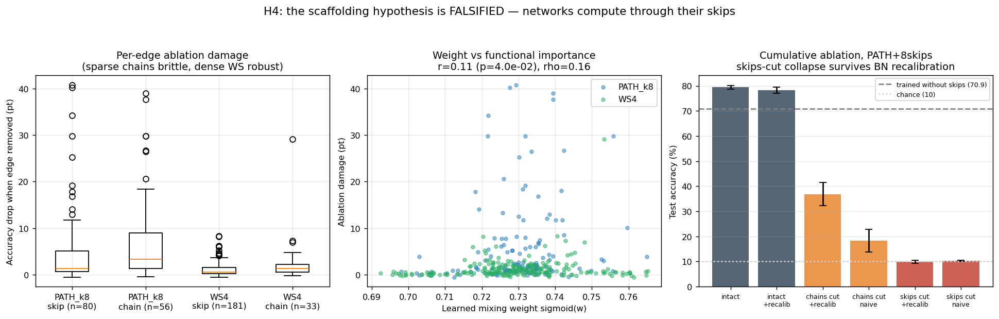
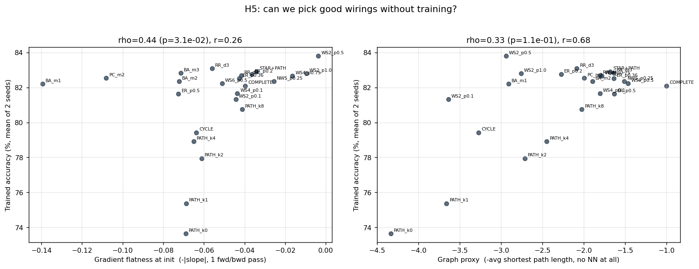
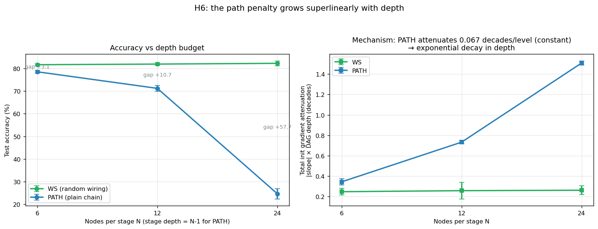

# Three Hypotheses, Three Verdicts

*Sequel to [The Wiring Lab](WIRING_LAB.md) and the [Short Paths Study](SHORT_PATHS_STUDY.md).
Three pre-registered hypotheses, tested one at a time. One was falsified by our
own experiment — which turned out to be the most informative result of the series.*

| # | Hypothesis | Verdict |
|---|---|---|
| **H4** | Skip edges are training-time scaffolding; the converged forward pass doesn't rely on them | ❌ **FALSIFIED** |
| **H5** | Init-time gradient flatness selects good wirings with zero training | ✅ Supported (top-1 regret = 0) |
| **H6** | The path penalty grows superlinearly with depth | ✅ Strongly supported (gap: +3 → +11 → +58) |

---

## H4 — The scaffolding hypothesis is dead. Long live co-adaptation.

**Background.** The Short Paths Study found that trained networks assign
*lower* mixing weights to skip edges (ρ = −0.35) despite skips causing the
accuracy gains. We interpreted this as "skips are gradient scaffolding, not
computation highways." That interpretation makes a falsifiable prediction:

> *P1: removing a skip edge at inference should cost less than its
> training-time value (+1.07 pt/edge). P2: removing ALL skips at inference
> should leave accuracy near the trained-without-skips baseline (70.9%).*

**Method.** Surgical inference-time ablation: setting a mixing logit to −∞
makes its sigmoid exactly 0, removing one edge from the forward pass.
Because ablation shifts every downstream input distribution, we added the
standard pruning-literature control: **BatchNorm recalibration** (reset
running stats, re-estimate on training data) — see `h4b_recalibration.py`.



**Results (PATH+8skips, 5 seeds).**

| Condition | Accuracy |
|---|---|
| Intact | 79.4 ± 1.5 |
| Intact + BN recalib (control) | 78.3 ± 2.3 ✓ recalibration is benign |
| All skips cut, naive | 10.4 (chance) |
| **All skips cut + BN recalib** | **9.9 (chance)** — the collapse is real |
| All chain-alternatives cut + recalib | 36.8 |
| *Reference: trained without skips* | *70.9* |

Both predictions failed. A single skip ablation costs +5.0 pt (4.7× its
training-time value, not less), and removing all skips destroys the network
completely even after recalibration — while networks *trained* without skips
reach 70.9%. The converged computation runs *through* the skips.

**The deeper finding is a double dissociation.** Learned mixing weights rank
chain edges above skips (0.733 vs 0.728), but ablation ranks skips above
chains (skips-cut → 9.9% vs chains-cut → 36.8%). Across all 350 ablated edges,
the learned weight barely predicts functional damage (ρ = 0.16), while a
training-free graph statistic — **edge betweenness centrality — predicts it
2.4× better (ρ = 0.38, p = 3×10⁻¹³)**. This recovers, in randomly wired
networks, a classic lesson of the pruning literature: *parameter magnitude is
a poor importance criterion*, and adds a new one: *the graph already knows
which edges matter*.

Bonus observation: dense random wirings are fault-tolerant (per-edge damage
−1.1 pt in WS4 vs −5.0 pt in PATH+8) — redundant short paths give
RandWireNN-style networks graceful degradation for free.

## H5 — You can pick a good wiring without training anything.

**Prediction.** The Short Paths Study showed init-time gradient imbalance
predicts accuracy (r = −0.59). If real, it should work *prospectively*: rank
24 unseen candidate wirings by gradient flatness (one forward/backward pass,
zero training) and the ranking should match post-training reality.

**Method.** 24 diverse candidates (ER/WS/BA/RR/NWS/PC/PATH+k/CYCLE/COMPLETE/
a star-chain hybrid), two proxies — (a) gradient flatness at init, (b) pure
graph proxy −L (no neural network at all) — then train everything (2 seeds)
and compare rankings.



| Proxy | Spearman ρ | p | Top-1 regret | Top-1 pick |
|---|---|---|---|---|
| **Gradient flatness** | **0.44** | **0.031** | **0.0 pt** | WS2_p0.5 — the actual best of all 24 (83.8%) |
| Graph −L | 0.33 | 0.114 (n.s.) | 1.7 pt | COMPLETE |

The gradient proxy works and the graph-only proxy doesn't: L separates chains
from everything else but cannot discriminate *within* the random-graph cluster
(all L ≈ 1.5–3), where the actual best and worst candidates live. The forward/
backward pass adds information the topology alone doesn't carry — e.g. BA_m1's
hub topology looks terrible to the gradient proxy (false negative) yet has
short paths; honest miss, reported as such. Connects this repo to the
zero-cost NAS literature (NASWOT, synflow) with a graph-native proxy.

## H6 — The path penalty is exponential in depth (the ResNet inevitability).

**Prediction.** If long paths hurt via per-level gradient attenuation, the
random-vs-chain gap must grow with the depth budget N.



| Nodes per stage | 6 | 12 | 24 |
|---|---|---|---|
| WS (random) | 81.7 | 82.0 | 82.3 |
| PATH (chain) | 78.6 | 71.2 | **24.6** |
| **Gap** | **+3.1** | **+10.7** | **+57.7** |

Random wiring is depth-indifferent; plain chains fall off a cliff. The
mechanism panel explains why: PATH attenuates gradients at a **constant
0.067 decades per level** regardless of N — so total attenuation is
exponential in depth (×0.86 per level; 1.5 orders of magnitude at depth 23) —
while WS holds total attenuation flat (~0.25 decades) at every N, because its
DAG depth grows only logarithmically. At N=6 a plain chain is a fine
architecture; at N=24 it is untrainable. This is the 2015 "plain nets stop
working, ResNets keep going" curve (He et al.), reproduced as a controlled
graph-theory experiment with the mechanism measured rather than assumed.

---

## What the series adds up to

1. **Why random wiring works** (Wiring Lab + Short Paths): random graphs have
   short paths generically; short paths keep gradient flow even; the effect is
   causal, partially mediated by init-time gradient imbalance.
2. **Why you can't read a network's anatomy off its weights** (H4): learned
   edge weights are nearly uninformative about functional importance; graph
   betweenness predicts ablation damage 2.4× better. Importance lives in the
   topology, not the parameters.
3. **What it's good for** (H5): a zero-training wiring-selection proxy with
   zero top-1 regret on a 24-candidate pool.
4. **When it matters** (H6): shallow nets don't care about wiring; deep nets
   are *only* about wiring. The penalty is exponential, with a measured decay
   constant.

## Limitations

Same scale caveats as before (FashionMNIST subset, 6 epochs, ~70–150K params).
H4's ablation severs edges abruptly; fine-tuning after ablation (rather than
BN recalibration alone) might recover more and would distinguish "co-adaptation"
from "irreplaceable computation". H5's pool has one proxy false-negative (BA_m1)
and the proxy was validated at n=24 — larger pools would tighten the estimate.
H6's N=24 PATH runs may partially reflect optimizer instability rather than
pure gradient attenuation (both are downstream of long paths).

## Reproduce

```bash
python h4_scaffolding.py       # per-edge + cumulative ablation (~7 min)
python h4b_recalibration.py    # BN-recalibrated cumulative ablation (~3 min)
python h5_zerocost.py          # 24-candidate zero-cost selection (~16 min)
python h6_scaling.py           # depth scaling, N in {6,12,24} (~10 min)
python h_followup_analysis.py  # figures + stats for H4/H6
```

Raw data and stats: [`docs/followup/`](docs/followup/)
