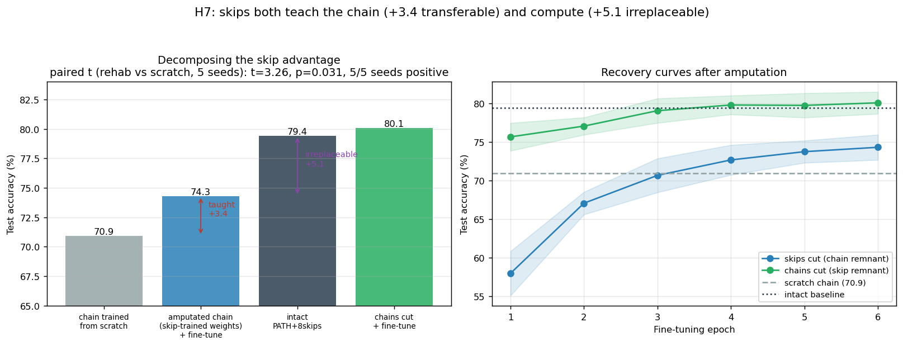
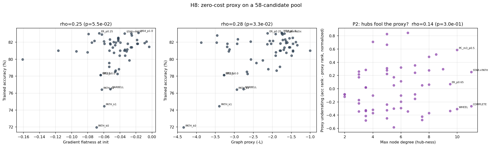

# Round 3 — Rehabilitation and the Limits of Zero-Cost Selection

*Continuing the series: [Wiring Lab](WIRING_LAB.md) → [Short Paths Study](SHORT_PATHS_STUDY.md)
→ [Three Hypotheses](FOLLOWUP_HYPOTHESES.md) → this. Two questions left open by
Round 2, answered with controlled experiments. One produced the cleanest result
of the whole series; the other produced an instructive partial failure.*

| # | Hypothesis | Verdict |
|---|---|---|
| **H7** | The ablation collapse (H4) reflects co-adaptation; fine-tuning the amputated chain recovers to the from-scratch chain level | ⚖️ **Better than predicted**: recovers *above* from-scratch — skips also *teach* the chain |
| **H8** | The zero-cost gradient proxy survives a 58-candidate pool; its failures concentrate on hub graphs | ⚠️ **Partial**: works as a top-k screener (regret@5 = 0), fails as a fine ranker; hub explanation rejected |

---

## H7 — The skip advantage, decomposed: 40% teaching, 60% computing

**The open question from H4.** Cutting all skips from a trained PATH+8skip
network collapses it to chance (9.9%), even after BN recalibration. Two
readings survived: the remaining chain weights are fine but *co-adapted*
(prediction: fine-tuning recovers them to the from-scratch chain level,
70.9%), or skips deposited transferable structure in the chain (prediction:
fine-tuning ends *above* 70.9%).

**Protocol.** Train PATH+8skips (5 seeds) → amputate all skips → fine-tune
6 epochs with the identical recipe → compare against PATH_k0-from-scratch,
*paired by seed* (same data order, same init seeds, from the Short Paths
Study). Ablated logits are saturated (−10⁹), so dead edges cannot resurrect
during fine-tuning — their sigmoid gradient is exactly zero.



**Results.**

| Condition | Accuracy |
|---|---|
| Chain trained from scratch (anchor) | 70.9 |
| **Amputated chain (skip-trained weights) + fine-tune** | **74.3 ± 1.6** |
| Intact PATH+8skips | 79.4 |
| Chains-cut remnant + fine-tune | 80.1 (full recovery) |

The amputated chain beats every chain ever trained from scratch — **+3.4
points, positive in 5/5 seeds, paired t = 3.26, p = 0.031**. The 8.5-point
skip advantage therefore decomposes into:

- **+3.4 pt of transferable knowledge** — structure the skips taught the chain
  weights during training, which survives their removal;
- **+5.1 pt of irreplaceable computation** — function the converged network
  can only realize *through* the skips.

So both Round-2 verdicts were each half right. H4's falsification stands (the
forward pass genuinely computes through skips — the strong scaffolding claim
is dead), but a weak scaffolding effect is real and now quantified: training
with shortcuts leaves the slow pathway measurably better trained. This is the
auxiliary-connection logic of knowledge distillation and deep supervision,
recovered from graph surgery alone. The symmetric condition seals the
asymmetry: the skip-heavy remnant fine-tunes back to baseline (80.1), the
chain remnant does not (74.3) — skips can replace chains, chains cannot
replace skips.

## H8 — Zero-cost proxies are anomaly detectors, not rankers

**The open question from H5.** At n=24 the gradient proxy ranked wirings at
ρ = 0.44 with zero top-1 regret. Does it survive a pool 2.4× larger and far
more diverse (58 candidates: ER/WS/BA/RR/NWS/PC families, deep chains, trees,
wheels, ladders, barbells, hybrids)? And are its failures systematically
hub-related (the BA_m1 anecdote)?



**Results (1 training seed per candidate).**

| Metric | Gradient proxy | Graph proxy (−L) |
|---|---|---|
| Spearman ρ (full pool) | 0.25 (p = 0.054) | 0.28 (p = 0.033) |
| Top-1 regret | 1.65 pt | 2.10 pt |
| **Regret@5 / @10** | **0.0 / 0.0 pt** | 1.1 / 0.6 pt |
| Within the healthy cluster (n=42, post-hoc) | ρ = 0.08 (n.s.) | ρ = −0.14 (n.s.) |

Three honest conclusions:

1. **The fine-ranking claim does not survive scale.** The H5 correlation
   shrank from 0.44 to 0.25 and the within-cluster diagnostic explains why:
   among healthy wirings the true accuracy spread (σ = 0.68 pt) is the same
   size as single-seed training noise, so there is nothing left to rank —
   for *any* proxy. All proxy signal comes from separating pathological
   wirings (chains, barbell, ring lattices) from healthy ones.
2. **As a screener it still earns its keep**: training only the gradient
   proxy's top-5 (a 91% reduction in training compute) finds the true best
   of all 58 candidates. That is the deployment mode that matters for NAS.
3. **P2 rejected.** Hub-ness does not systematically explain proxy errors
   (ρ = 0.14, p = 0.30). The BA_m1 false negative is real but it is an
   anecdote, not a mechanism — we pre-registered the hub explanation and the
   data declined it.

## Where the series now stands

The five-study arc, compressed:

> Random wiring works because random graphs generically have short paths
> (Lab, Study); short paths act causally, partly via init-time gradient flow
> (H1–H3); the resulting networks compute *through* their shortcuts (H4) while
> also being *taught by* them (+3.4 pt transferable, +5.1 pt irreplaceable, H7);
> the penalty for lacking shortcuts grows exponentially with depth at a
> measured 0.067 decades/level (H6); and a one-pass gradient probe can weed
> out doomed wirings before training, though nothing distinguishes good
> wirings from each other — at this scale, all healthy random graphs really
> are equivalent (H5, H8), which is the 2019 paper's claim, now with a
> mechanism and boundary conditions attached.

## Limitations

Paired anchor for H7 reuses Short Paths Study runs (identical seeds/recipe,
but not re-randomized); fine-tuning budget (6 ep) was not tuned — longer
rehabilitation might close more of the 5.1-pt gap, which would shift the
decomposition toward "teaching". H8 used one training seed per candidate by
design (n=58 rank power vs per-point noise tradeoff); the within-cluster
diagnostic is post-hoc and labeled as such. All scale caveats from previous
rounds apply.

## Reproduce

```bash
python h7_rehab.py        # amputation + fine-tuning, 5 seeds (~5 min)
python h7_figure.py       # decomposition figure + paired t-test
python h8_proxy_scale.py  # 58-candidate zero-cost screening (~16 min)
```

Raw data: [`docs/round3/`](docs/round3/)
