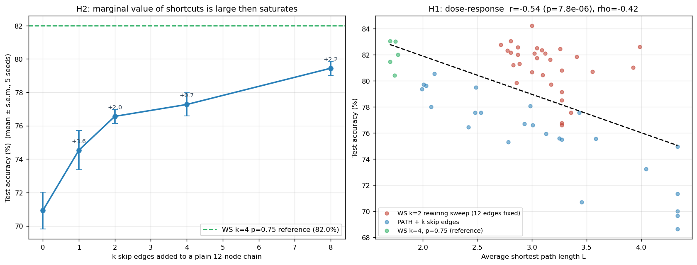
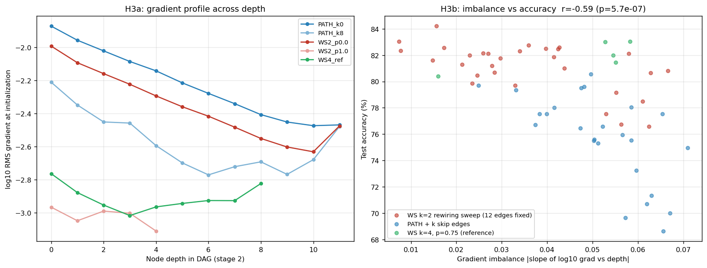
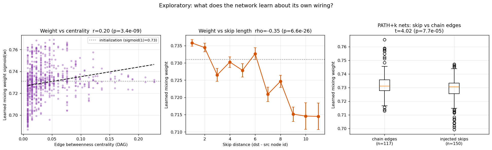

# Short Paths: From Correlation to Mechanism

*A controlled follow-up to [The Wiring Lab](WIRING_LAB.md). 60 training runs,
3 pre-registered hypotheses, mediation analysis, and one genuinely surprising
result about what randomly wired networks learn about their own wiring.*

## Abstract

The Wiring Lab observed that average shortest path length L correlates with
accuracy across network topologies (r = −0.84), but that result was
correlational and confounded — edge count, clustering, and path length all
co-varied across graph families. Here we test the path-length hypothesis with
**controlled interventions**: (1) rewiring a fixed-edge-count ring (WS k=2
sweep) and (2) injecting k skip edges into a plain chain. We instrument every
run with per-node **gradient measurements at initialization** and extract the
**learned per-edge mixing weights** after training. We find: the path-length
effect survives confound control (partial r = −0.46, p < 3e-4); the first skip
edge added to a chain is worth ~10× more than later ones; gradient imbalance
across depth strongly predicts accuracy (r = −0.59) and **partially mediates**
the path-length effect (~28%, bootstrap CI excludes zero); and — unexpectedly —
trained networks assign *lower* mixing weights to long skip edges even though
those edges cause the accuracy gains, suggesting skips act as **training-time
gradient scaffolding rather than dominant forward-computation paths**.

## 1. Pre-registered hypotheses

- **H1 (causal dose-response).** Holding edge count constant, accuracy
  increases as the wiring's average path length decreases.
- **H2 (marginal value of shortcuts).** Adding k random skip edges to a plain
  chain yields diminishing returns in k.
- **H3 (mechanism).** The path-length effect is mediated by uneven gradient
  flow across DAG depth, measurable at initialization.
- **Exploratory.** Trained networks assign higher mixing weights to
  structurally central (high-betweenness) edges.

## 2. Methods

**Backbone & budget.** TinyRandWireNN (stem + two 12-node randomly wired
stages, ~70–74K params for all wirings), FashionMNIST fixed subset
(4,000 train / 2,000 test), AdamW + cosine, 6 epochs — identical to the Wiring
Lab. 12 configurations × 5 seeds = **60 runs** (~21 min total, CPU).

**Interventions.**

| Family | Configurations | What it isolates |
|---|---|---|
| `WS2_p{0…1}` | WS k=2, p ∈ {0, .1, .25, .5, .75, 1} | Path length at **exactly 12 edges** and constant degree distribution |
| `PATH_k{0,1,2,4,8}` | plain chain + k random skips | Marginal causal value of each shortcut |
| `WS4_ref` | WS k=4, p=0.75 | The paper's generator, as reference |

**Instrumentation.** At initialization, one forward/backward pass records the
RMS gradient of each node's conv parameters; the slope of log₁₀(RMS) vs. DAG
depth defines **gradient imbalance** (0 = perfectly even flow). After
training, each multi-input node's sigmoid mixing weights are extracted per
edge together with that edge's betweenness centrality and skip distance
(829 edge records).

**Statistics.** Pearson/Spearman with p-values; partial correlation by
covariate residualization; mediation via standardized OLS with 5,000-sample
percentile bootstrap for the indirect effect. Raw stats:
[`docs/wiring_study/stats_summary.json`](docs/wiring_study/stats_summary.json).

## 3. Results

### H1 — The path-length effect survives confound control ✅ (with one honest nuance)



| Test | Result |
|---|---|
| All 60 runs, acc ~ L | r = −0.54, p = 7.8e-6; ρ = −0.42, p = 7e-4 |
| **Partial corr., controlling edge count + input-node count** | **r = −0.46, p = 2.6e-4** |
| WS2 sweep only (edge count fixed at 12) | ρ = −0.46, p = 0.011 (Spearman) |
| WS2 sweep only, Pearson | r = −0.27, p = 0.145 (n.s.) |

Within the edge-count-controlled WS2 sweep the relationship is **monotonic but
not linear**: rank correlation is significant while Pearson is not, because
realized L is a noisy readout of the rewiring dose at N=12 (a single rewired
edge can lengthen some paths while shortening others). Accuracy tracks the
intervention (p) reliably: the ring lattice (p=0) averages 78.4% vs. 82.1% at
p≥0.5.

### H2 — The first shortcut is worth ~10× the rest ✅

| k skips | 0 | 1 | 2 | 4 | 8 |
|---|---|---|---|---|---|
| Accuracy (%) | 70.92 | 74.53 | 76.56 | 77.27 | 79.44 |
| Marginal gain **per edge** | — | +3.61 | +2.03 | +0.36 | +0.54 |

A single random skip edge recovers +3.6 points; per-edge returns then collapse
by an order of magnitude. Notably, even 8 retrofitted skips (79.4%) do not
reach the natively random reference (82.0%) — a chain is a hole you climb out
of, not a foundation you build on.

### H3 — Gradient imbalance partially mediates the effect ✅ (28%)



The gradient profile at initialization (left panel) is striking: chain-like
wirings (PATH_k0, WS2_p0) lose ~0.6 orders of magnitude of per-parameter
gradient across 11 depth levels, while short-path wirings (WS2_p1.0) are
nearly flat. Statistically:

- Imbalance → accuracy: **r = −0.59, p = 5.7e-7** (stronger than L itself)
- L → imbalance: r = 0.32, p = 0.013
- **Mediation** (L → imbalance → acc, standardized): total effect c = −0.54,
  direct c′ = −0.39, indirect ab = **−0.15, bootstrap 95% CI [−0.30, −0.04]**
  → significant *partial* mediation, **27.6%** of the total effect.

Interpretation: uneven gradient flow at initialization is a real, measurable
channel through which long paths hurt — but it explains only about a quarter
of the effect. The remainder is direct or flows through unmeasured mediators
(e.g., optimization dynamics later in training, feature-reuse capacity).

### Exploratory — The network does *not* lean on its shortcuts 🔍 (surprise)



From 829 learned edge weights across all 60 trained networks:

| Relation | Result |
|---|---|
| weight ~ edge betweenness | r = +0.20, p = 3.4e-9 (ρ = +0.35); survives controlling fan-in (r = +0.20) |
| weight ~ skip distance | **ρ = −0.35, p = 6.6e-26** |
| PATH+k nets: injected skips vs. chain edges | skips *lower*: 0.728 vs 0.733, t = 4.0, p = 7.7e-5 |

The networks upweight **structurally central** edges (high betweenness — the
trunk roads that many paths share) but **downweight long skips** — the very
edges whose presence causes the +8.5-point improvement from PATH_k0 to
PATH_k8. The wiring that helps most is not the wiring the forward pass relies
on most.

This dissociation supports a scaffolding account: skip edges matter because
they keep gradients flowing during training (H3), not because the converged
network routes most of its computation through them. It is consistent with
Veit et al. (2016) — residual networks behave like ensembles of *short* paths —
and with a feature-mismatch reading: a skip from depth 0 delivers raw features
to a depth-9 node, which the node learns to slightly discount. (Effect sizes
on the weights are small after 6 epochs — sigmoid weights barely move from
their 0.731 initialization — but the direction is highly significant.)

## 4. Discussion

Together the three experiments upgrade the Wiring Lab's correlation into a
small causal-mechanistic account:

1. **Causal**: shortening paths at fixed edge count raises accuracy (H1), and
   each shortcut's marginal value decays sharply (H2). "Random wiring works"
   compresses to "a few shortcuts suffice, and random graphs have them
   generically."
2. **Mechanistic**: about a quarter of the effect is attributable to gradient
   imbalance measurable *before training* (H3) — which also suggests a
   zero-cost architecture-search proxy: rank candidate wirings by the flatness
   of their init-time gradient profile, no training needed.
3. **Functional**: shortcuts are gradient infrastructure, not computation
   highways (exploratory). The ResNet lesson, recovered from random graphs.

## 5. Limitations

Tiny scale (12-node graphs, 70K params, FashionMNIST, 6 epochs); gradient
imbalance measured only at initialization (slope estimates are noisy for
shallow DAGs — the WS4 reference shows moderate slopes despite high accuracy);
mixing-weight effects are small in magnitude after short training; input-node
count co-varies with topology by construction of the architecture (controlled
for statistically, not experimentally). Mediation analysis assumes linearity.

## 6. Reproduce

```bash
python wiring_study.py --dataset fashion    # 60 runs, ~21 min on CPU
python wiring_study_analysis.py             # figures + stats_summary.json
```

Raw data: [`results.jsonl`](docs/wiring_study/results.jsonl) (per-run metrics,
gradient profiles), [`edge_weights.jsonl`](docs/wiring_study/edge_weights.jsonl)
(829 learned edge weights with centrality annotations).
