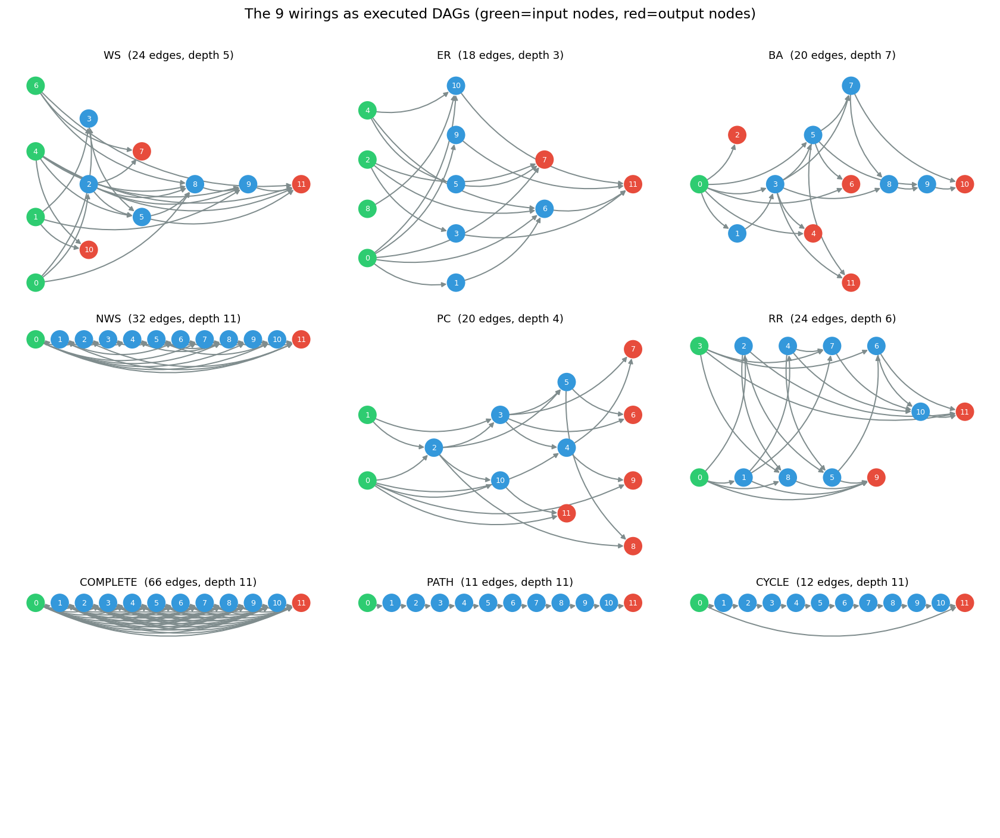
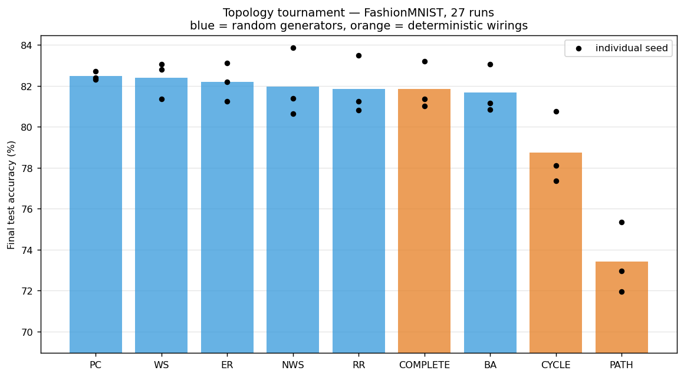
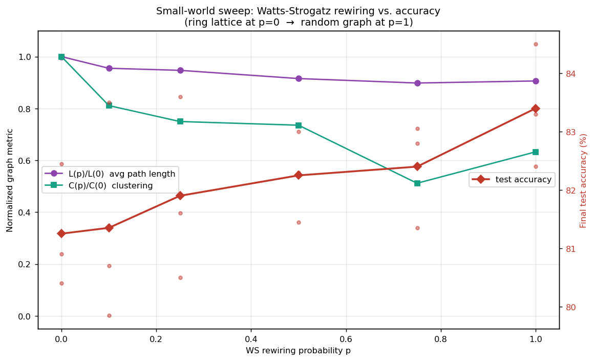
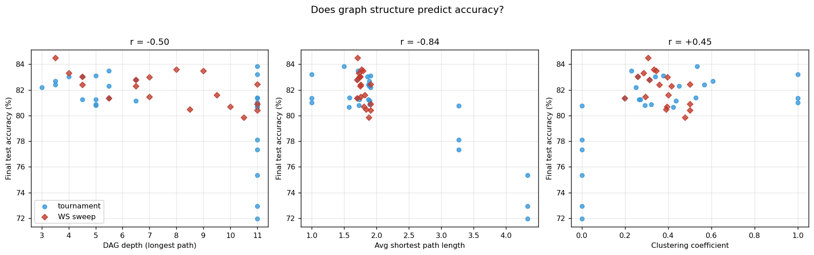

# The Wiring Lab — Does the Wiring Actually Matter?

*A 2026 mini-replication of "Exploring Randomly Wired Neural Networks for Image
Recognition" (Xie et al., 2019), run entirely on CPU in ~15 minutes.*

## The question

The 2019 paper's provocation was that **randomly wired networks compete with
hand-designed architectures** — implying the network *generator* matters more
than any individual wiring. Seven years later, with this repo modernized, we
re-ask the question at miniature scale:

1. Do different random graph families really perform the same?
2. Is there *any* wiring that fails?
3. Which graph-theoretic property actually predicts accuracy?

## Setup

Fairness is built into the architecture: in RandWireNN every **node** carries a
conv unit while **edges** only add scalar mixing weights, so at a fixed node
budget all wirings have nearly identical parameter counts (68–74K here).

| | |
|---|---|
| Backbone | `TinyRandWireNN` — stem + 2 randomly wired stages (12 nodes each) |
| Dataset | FashionMNIST, fixed subset: 4,000 train / 2,000 test |
| Recipe | AdamW (lr=1e-3, wd=0.01), cosine schedule, 6 epochs, batch 64 |
| Fairness | mean degree matched to ~4 across families; same data, recipe, budget |
| Statistics | 3 seeds per configuration, 45 runs total, ~20 s per run (CPU) |

The 9 wirings, as the DAGs actually executed by `StageBlock`:



## Experiment 1 — Topology tournament

9 graph families, identical training recipe:



| Topology | Test acc (mean ± std) | Edges | Avg path length L | Clustering C |
|----------|----------------------|-------|--------------------|---------------|
| PC (powerlaw cluster) | **82.47 ± 0.17** | 20 | 1.88 | 0.54 |
| WS (small-world, p=0.75) | 82.40 ± 0.75 | 24 | 1.71 | 0.26 |
| ER (Erdős–Rényi) | 82.18 ± 0.76 | 22 | 1.90 | 0.30 |
| NWS (Newman–Watts) | 81.97 ± 1.37 | 32 | 1.55 | 0.49 |
| RR (random regular) | 81.85 ± 1.18 | 24 | 1.72 | 0.26 |
| COMPLETE (DenseNet-like) | 81.85 ± 0.97 | 66 | 1.00 | 1.00 |
| BA (scale-free) | 81.68 ± 0.97 | 20 | 1.88 | 0.36 |
| CYCLE (chain + 1 skip) | 78.73 ± 1.46 | 12 | 3.27 | 0.00 |
| PATH (plain chain) | **73.42 ± 1.43** | 11 | 4.33 | 0.00 |

**Finding 1 — the paper's claim replicates.** All six random generators land
within 0.8 points of each other (81.7–82.5%), inside seed noise. Among random
graphs, the specific family is irrelevant.

**Finding 2 — but wiring is not *completely* irrelevant.** PATH — a plain
12-layer chain with no skip connections, i.e. a pre-ResNet "plain net" — loses
**~9 points**. The failure mode the paper's framing hides is binary: it isn't
*which* wiring you choose, it's *whether your wiring has short paths at all*.

**Finding 3 — one skip connection is worth ~5 points.** CYCLE is PATH plus a
single long skip edge (node 0 → node 11). That one edge recovers 5.3 of the 9
lost points. This is the ResNet lesson reproduced as a graph-theory ablation.

**Finding 4 — all-to-all buys nothing.** COMPLETE (66 edges, every possible
skip — essentially DenseNet wiring) performs identically to sparse random
graphs with a third of the edges. Once paths are short, extra edges are
redundant.

## Experiment 2 — Small-world sweep

Watts–Strogatz wiring with rewiring probability p swept from 0 (ring lattice)
to 1 (fully random), the classic 1998 small-world experiment with test accuracy
overlaid:



| p | 0.0 | 0.1 | 0.25 | 0.5 | 0.75 | 1.0 |
|---|-----|-----|------|-----|------|-----|
| Test acc (%) | 81.25 | 81.35 | 81.90 | 82.25 | 82.40 | **83.40** |

Accuracy rises **monotonically** with rewiring. As random shortcuts replace
local ring edges, average path length drops and accuracy follows. The original
paper found p=0.75 optimal at ImageNet scale; at our tiny scale fully random
(p=1.0) edges it out — but the direction of the trend is the same: *more
shortcuts, better network*.

## Experiment 3 — What actually predicts accuracy?

Correlating accuracy against graph structure across all 45 runs:



| Metric | Correlation with accuracy |
|--------|---------------------------|
| **Avg shortest path length** | **r = −0.84** |
| DAG depth (longest path) | r = −0.50 |
| Clustering coefficient | r = +0.45 (confounded: chains have C=0) |

**The wiring doesn't matter — the path length does.** Average shortest path
length explains most of the variance. This is *why* random wiring works:
almost any random graph has a small diameter (the small-world phenomenon), so
random wiring gets short gradient paths for free. Hand-designed chains don't.

## Takeaways

1. **Replicated**: among degree-matched random generators, the graph family is
   irrelevant — exactly the 2019 claim, now verified for $0 of compute.
2. **Sharpened**: the claim has a boundary. Wirings *without* short paths
   (plain chains) fail badly. "Random wiring works" is really "short paths
   work, and randomness is a cheap way to get them."
3. **Quantified**: one skip connection ≈ +5 points; path length predicts
   accuracy at r = −0.84.
4. The 2019 paper, ResNet, DenseNet and the Watts–Strogatz small-world model
   are all the same story told in different dialects: **keep the paths short.**

## Limitations

Tiny scale (12-node graphs, 70K params), one dataset, 6-epoch budget, 3 seeds.
Directionally consistent with the original paper's ImageNet-scale findings,
but absolute numbers should not be over-read.

## Reproduce

```bash
pip install -r requirements.txt
python wiring_lab.py --dataset fashion   # ~15 min on CPU, 45 runs
python wiring_lab_plots.py               # figures + summary table
```

Raw per-run results: [`docs/wiring_lab/results.jsonl`](docs/wiring_lab/results.jsonl)
